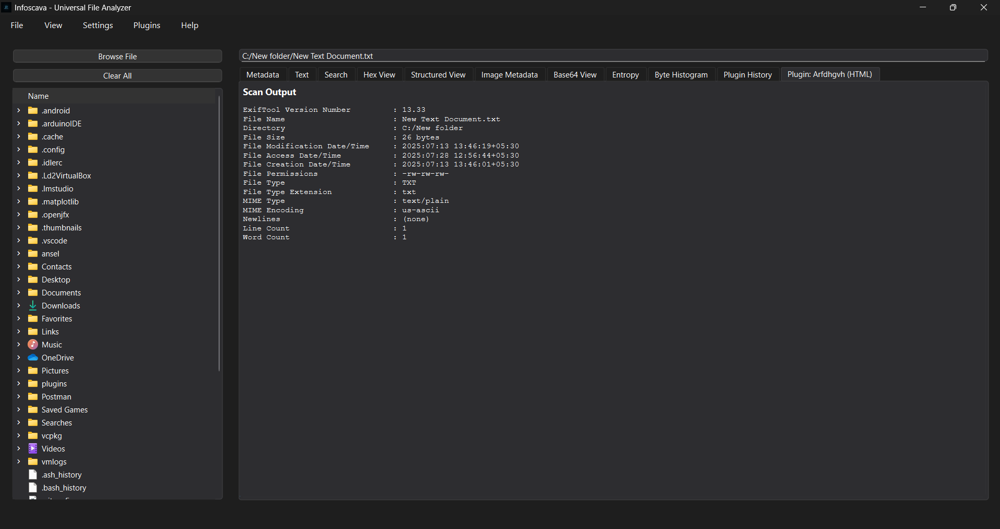

# Infoscava Plugin Creator (Sample Tool)

This is a sample GUI-based Python application for generating `.infoscava` plugin files for the **Infoscava** analysis framework.

## Features

- Allows creating plugins for tools like:
  - YARA
  - ExifTool
  - Strings
  - Sigcheck
- Supports return formats in:
  - JSON
  - HTML
  - Plain Text
- Automatically base64-encodes the Python analysis function into the plugin file
- Provides a GUI to input metadata, select executables, and customize arguments

## Screenshot

## License

This sample code is licensed under the **MIT License**.

---

> ⚠️ This project is just a sample meant to demonstrate how Infoscava plugin files can be generated. It is **not production-ready** and is meant for educational or internal use.
